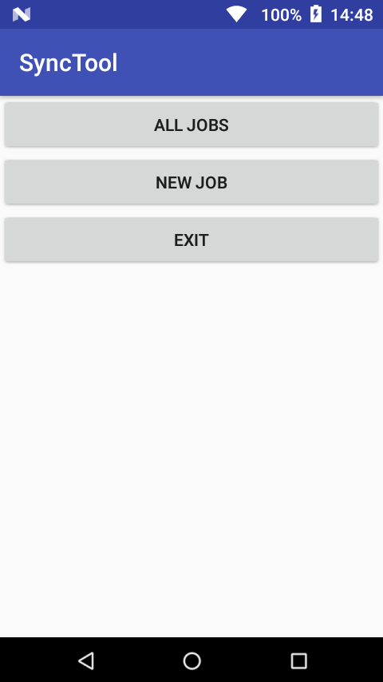
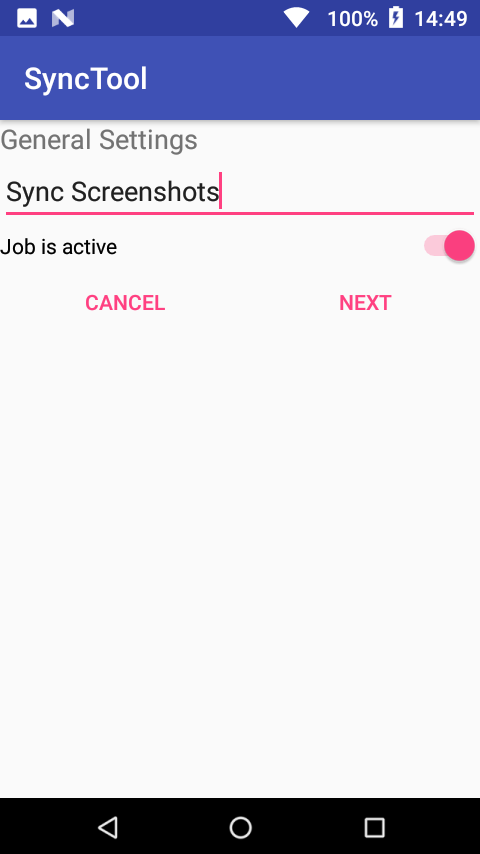
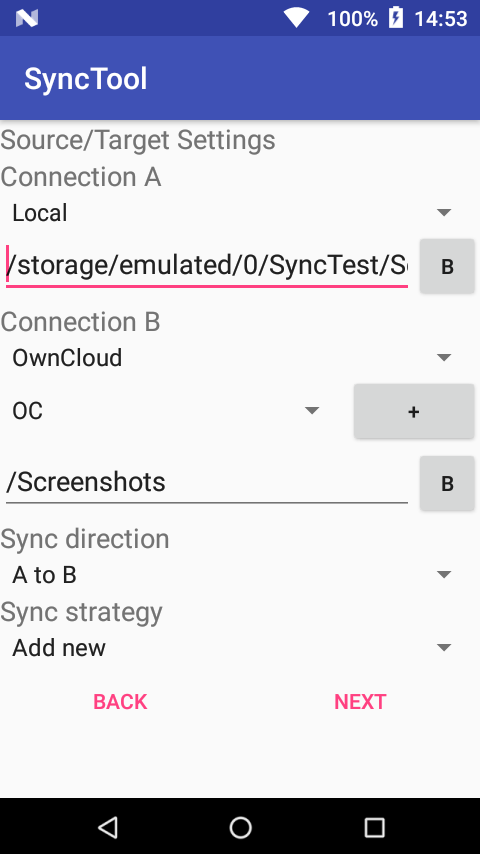
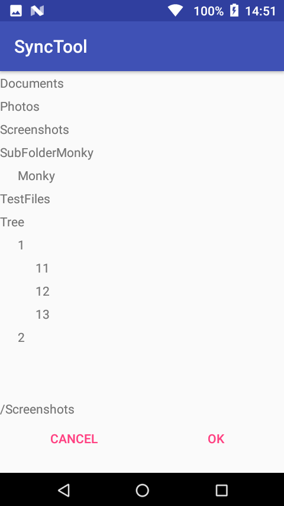
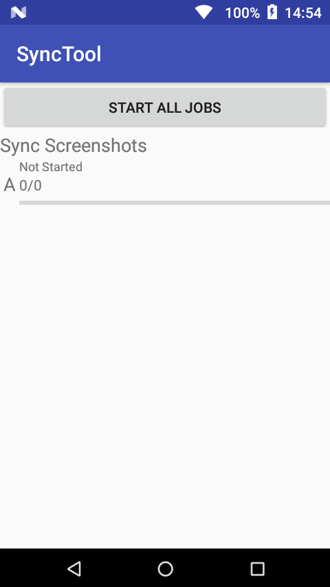
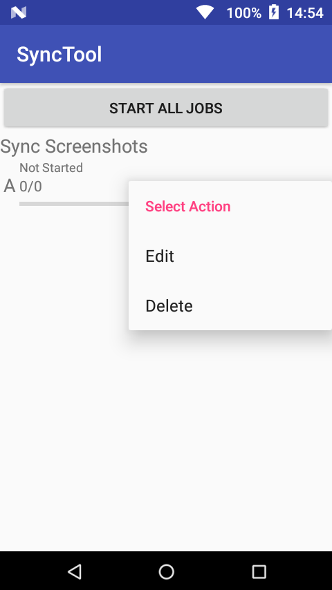

# Synctool
Synctool is written initial to replace "Syncronize Ultimate".

Prio number 1 usecase is synchronize data from Smartphone to Owncloud server.

In every case I need nice guys who are helping me in GUI things. I'm a very bad GUI creator. ;)

## Screenshots
Here you can see the main menue of the application.

To create a new job you press "NEW JOB" and the first wizzard page will open. On the first page you can give a name and switch job on and off. The second page is to select the source and targets. For connections like OwnCloud or FTP you can setup named connection. So you need only setup the credentials one time. With Button (+) you can add a new named connection. With Button (B) it's possible to browse the folder tree on the connection to select the relative path. This is shown in the last picture of them.
Also you can select the sync strategie and direction.

 

In Menue "ALL JOBS" you have a list with all jobs. You can select each of them. So you can edit or delete them with the context menue.

 

## Features
### Targets
- Local Files
- Owncloud
- FTP

### Directions
- One Side
  - From A to B
  - From B to A
- Booth Directory
 
### Strategies
- One Side
  - Copy new files
  - Mirror
  - Copy new filles in a folder with actual date
  - Copy all files in a folder with actual date
  - Move File
  - Move in a folder with actual date
- Booth Directions
  - One side wins
  - Date check
  
  ### Trigger
   - Trigger daily on selected time
